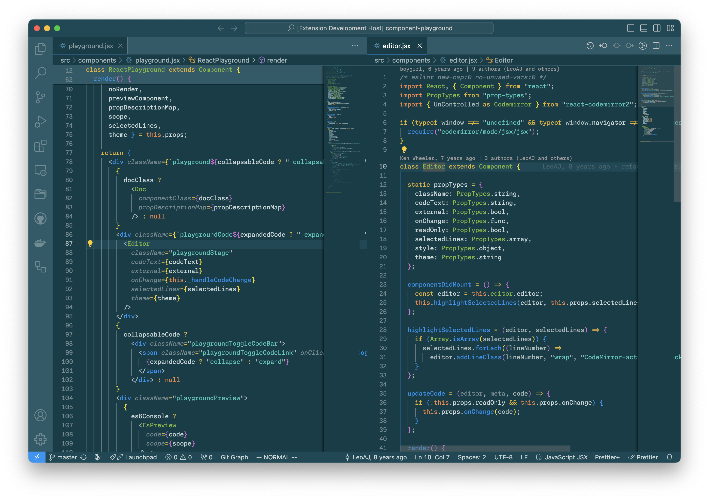

# 🌤️ Solarized and Selenized 🌖 for VS Code

[Solarized](https://ethanschoonover.com/solarized/) is a sixteen color palette
(eight monotones, eight accent colors) designed by Ethan Schoonover.

[Selenized](https://github.com/jan-warchol/selenized) is a redesign on Solarized
by Jan Warchoł. It improves on Solarized by providing better contrast and more
distinguishable accent colors.

The color values and comparison between both can be seen in this
[blog post](https://pensieve.swijaya.me/solarized-selenized-cheatsheet).

This extension contains the following color themes and variants:

* Selenized Light 🌖
* Selenized Dark 🌒
* Solarized Light
* Solarized Dark

## Screenshots

### Workbench (UI)

(Selene) Selenized Light 🌖 and Dark 🌒


### Editor

(Selene) Selenized Light 🌖 and Dark 🌒




## Templatized color theme files

Maintaining loose vscode color theme extension JSON files with raw sRGB values
is tedious. So, I broke them up into shareable components as Liquid template
partials.

Let's take a look at a top-level [`selenized/light-color-theme.json.liquid`][1]
file, for instance. This file compiles to the unwieldy vscode color theme file
[`Selenized_Light-color-theme.json`][2]. However, the "source" template itself
is quite simple:

```liquid

```

Where [`_selenized-color-theme.json.liquid`][3] is a Selenized color theme
template that can be instantiated in dark or light variant with the injected
variable `type`.

Taking this idea further, the content of *that* template is further broken down
into its constituents parts: **Workbench** (UI) colors, TextMate
**scoped token** (fallback) colors, and **semantic syntax token** (LSP-provided)
colors.

```liquid


{
  "name": "Selenized {{ type | capitalize }}",
  "type": "{{ type }}",

  // Workbench (UI) colors
  "colors": ,

  // TextMate scoped token highlight colors (fallback)
  "tokenColors": ,

  // Semantic token (LSP-provided) colors
  "semanticHighlighting": true,
  "semanticTokenColors": 
}
```

As you can see, each component template is injected with a theme-agnostic array
of 16 base colors. They roughly follow the [Base16][4] color theming framework.

What this means is that `colors`, `tokenColors`, and `semanticTokenColors` can
now be expressed in terms of color variable names that are independent of the
target color theme. For example:

```liquid



...

  {
    "name": "Language Constants",
    "scope": [
      "constant.language",
      "support.constant",
      "variable.language"
    ],
    "settings": {
      "foreground": "#{{ orange }}"
    }
  },
  {
    "name": "Variables",
    "scope": [
      "variable",
      "variable.parameter",
      "support.variable"
    ],
    "settings": {
      "foreground": "#{{ fg_0 }}"
    }
  },
```

This also keeps things DRY. The same template files are shared between Selenized
Light, Selenized Dark, Solarized Light, and Solarized Dark--the four
colorschemes that are defined in this repository. It makes tweaking colors a
lot easier and maintenance much less tedious.

These three core components are defined as three template partials files in
[`common/`][5] directory.

## Palette for color values injection

The templates (and the shared components partials that they instantiate) are
injected with color values that are derived from one of the [palette files][6].
Each of them is defined as a yaml file that contains 16 colors (per Base16
convention).

Each color in a palette has a name and index in a `colors` array. Its canonical
values are in CIE L\*a\*b\* colorspace. The palette file must first be processed
to convert those values into sRGB, and then into Liquid objects before they can
be injected into the templates for rendering the final vscode JSON files.

## For more information

* [Theme Color][7]
* [Visual Studio Code extension guide: Color Theme][8]
* [Semantic coloring in Color Themes][9]

[1]: themes/selenized/light-color-theme.json.liquid
[2]: themes/Selenized_Light-color-theme.json
[3]: themes/selenized/_selenized-color-theme.json.liquid
[4]: https://github.com/chriskempson/base16/blob/main/styling.md
[5]: themes/common
[6]: palettes
[7]: https://code.visualstudio.com/api/references/theme-color
[8]: https://code.visualstudio.com/api/extension-guides/color-theme
[9]: https://code.visualstudio.com/api/language-extensions/semantic-highlight-guide#semantic-coloring-in-color-themes
